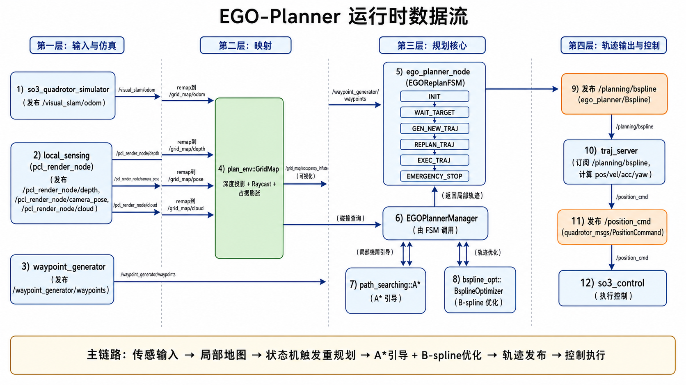

# EGO-Planner 工程系统学习总结（面向初学者）

> 这份文档基于当前工程代码梳理（`ego-planner`），目标是帮你从“能跑起来”走到“看得懂、能改动、会调参”。

## 1. 工程是做什么的

EGO-Planner 是一个面向四旋翼的**局部轨迹规划器**，核心特点是：

- 以 **B-spline 轨迹优化**为核心
- 避免构建 ESDF（官方论文称 ESDF-free）
- 在局部地图上快速重规划（replan）
- 输出控制可执行的轨迹命令

在这个仓库里，它不仅有规划器，还附带了完整的仿真链路（地图、传感器、动力学、控制器、可视化）。

---

## 2. 代码总体结构（先有全局地图）

仓库核心在 `src/` 下分两大部分：

- `src/planner`：规划算法主体
- `src/uav_simulator`：仿真环境与工具

你可以把它理解为：

- `planner` 决定“飞哪条轨迹”
- `uav_simulator` 提供“地图、传感器、无人机、控制闭环”

### 2.1 planner 层

`src/planner` 下 5 个核心包：

1. `plan_manage`（包名 `ego_planner`）
- 状态机、规划流程调度、轨迹发布
- 可执行节点：`ego_planner_node`、`traj_server`

2. `plan_env`
- 局部栅格地图（占据、膨胀、深度投影、raycast）
- 对外提供碰撞查询接口

3. `path_searching`
- 3D A*（`dyn_a_star`）
- 为优化器提供绕障引导路径

4. `bspline_opt`
- B-spline 表达与优化器（L-BFGS）
- 代价：平滑、碰撞、动力学可行、拟合

5. `traj_utils`
- 多项式轨迹、可视化工具
- 用于全局参考轨迹构建与 RViz 显示

### 2.2 simulator 层

`src/uav_simulator` 主要包含：

- `local_sensing`：模拟传感器（CPU/GPU 两模式）
- `map_generator` / `mockamap`：障碍地图生成
- `so3_quadrotor_simulator`：四旋翼动力学仿真
- `so3_control`：SO3 控制器（nodelet）
- `Utils/*`：`quadrotor_msgs`、`waypoint_generator`、`odom_visualization` 等工具包

---

## 3. 运行时数据流（最关键）

把主流程记成这 8 步就够了：

1. 仿真器发布 odom（默认 `/visual_slam/odom`）
2. 本地传感器发布深度/点云（如 `/pcl_render_node/depth`、`/pcl_render_node/cloud`）
3. `plan_env/GridMap` 订阅并更新占据与膨胀地图
4. 用户通过 RViz 2D Nav Goal 或预设 waypoint 给目标
5. `EGOReplanFSM` 触发状态机，调用 `EGOPlannerManager`
6. `EGOPlannerManager`：先构造初始轨迹，再调用 `BsplineOptimizer`
7. 优化成功后发布 `ego_planner/Bspline` 到 `/planning/bspline`
8. `traj_server` 将 B-spline 采样成 `quadrotor_msgs/PositionCommand`（`/position_cmd`）供控制器执行

一句话：
**传感输入 -> 地图 -> 状态机触发重规划 -> B-spline 优化 -> 控制命令输出**。

---

## 4. 核心模块详解（按源码角色）

## 4.1 `plan_manage`：系统“大脑”

### A) `EGOReplanFSM`（状态机）
位置：`src/planner/plan_manage/src/ego_replan_fsm.cpp`

状态定义：

- `INIT`
- `WAIT_TARGET`
- `GEN_NEW_TRAJ`
- `REPLAN_TRAJ`
- `EXEC_TRAJ`
- `EMERGENCY_STOP`

核心机制：

- `exec_timer`（0.01s）周期执行 FSM
- `safety_timer`（0.05s）周期做碰撞前瞻检查
- 当前轨迹若即将碰撞：先尝试局部重规划，失败再进入紧急停

你要重点读的函数：

- `init(...)`：参数和订阅初始化
- `execFSMCallback(...)`：状态切换主逻辑
- `checkCollisionCallback(...)`：安全检查
- `callReboundReplan(...)`：发起一次重规划并发布新轨迹
- `getLocalTarget()`：在全局参考轨迹上截取局部目标点

### B) `EGOPlannerManager`（算法编排器）
位置：`src/planner/plan_manage/src/planner_manager.cpp`

职责：

- 初始化 `GridMap`、`BsplineOptimizer`、`AStar`
- 生成全局参考轨迹（多项式 min-snap）
- 执行局部 B-spline 重规划
- 失败时做重试与回退策略

核心接口：

- `planGlobalTraj(...)` / `planGlobalTrajWaypoints(...)`
- `reboundReplan(...)`
- `EmergencyStop(...)`

`reboundReplan(...)` 可理解为 3 阶段：

1. **INIT**：构造初始轨迹（多项式或上一条轨迹延拓）并离散为控制点
2. **OPTIMIZE**：碰撞+平滑+可行性联合优化
3. **REFINE**：若速度/加速度超限，拉伸时间并再次优化

### C) `traj_server`
位置：`src/planner/plan_manage/src/traj_server.cpp`

职责：

- 订阅 `/planning/bspline`
- 在当前时间 `t_cur` 计算位置/速度/加速度
- 计算前视 yaw（`time_forward`）
- 发布 `/position_cmd`

你可以把它看成“轨迹解释器 + 命令下发器”。

---

## 4.2 `plan_env`：局部地图与碰撞查询

核心类：`GridMap`（`src/planner/plan_env/src/grid_map.cpp`）

它做了两条输入链融合：

1. 深度图 + 位姿（`depthPoseCallback` / `depthOdomCallback`）
2. 直接点云 + 里程计（`cloudCallback` + `odomCallback`）

关键流程：

- `projectDepthImage()`：深度投影到世界坐标
- `raycastProcess()`：沿光线更新占据概率（log-odds）
- `clearAndInflateLocalMap()`：清理局部外区域并做障碍膨胀

规划器主要调用的接口：

- `getInflateOccupancy(pos)`：是否碰撞
- `getResolution()`：地图分辨率

理解要点：

- 规划时主要看的是 **膨胀占据图**（不是原始点）
- 膨胀半径由 `grid_map/obstacles_inflation` 决定，本质对应安全距离

---

## 4.3 `path_searching`：A* 引导

核心类：`AStar`（`dyn_a_star.cpp`）

作用不是直接输出最终可飞轨迹，而是：

- 在障碍段上提供“绕障方向提示”
- 给 B-spline 碰撞代价一个更稳定的引导

特点：

- 26 邻域搜索
- 启发函数为对角距离（带轻微 tie-breaker）
- 单次搜索有时间上限（0.2s）

---

## 4.4 `bspline_opt`：轨迹优化核心

### A) `UniformBspline`
位置：`uniform_bspline.cpp`

提供：

- De Boor 求值
- 导数轨迹（速度、加速度）
- 轨迹长度、jerk、速度/加速度统计
- `checkFeasibility(...)` 可行性检查
- `parameterizeToBspline(...)` 点集参数化到控制点

你当前打开的文件就是这里，它是理解整个优化器的数学基础。

### B) `BsplineOptimizer`
位置：`bspline_optimizer.cpp`

重规划（Rebound）代价项：

- `Smoothness`：控制 jerk 平滑
- `Distance`：远离障碍（含 A* 引导方向）
- `Feasibility`：惩罚超速度/超加速度

精修（Refine）代价项：

- `Smoothness`
- `Fitness`：贴近参考轨迹
- `Feasibility`

求解器：

- 使用 `LBFGS-Lite`（头文件库）

工程实现上，优化并不是“一次必成”，会有：

- 碰撞复检
- 增大碰撞权重重试
- 触发 rebound 重新建立引导

这部分是 EGO-Planner 稳定性的关键来源。

---

## 5. Launch 与节点关系

主要 launch：

- `simple_run.launch`：带 RViz，`flight_type=2`（预设航点）
- `run_in_sim.launch`：不自动开 RViz，`flight_type=1`（2D Nav Goal）

它们都会 include：

- `advanced_param.xml`：核心参数
- `simulator.xml`：仿真地图+飞行器+控制器+传感器

`advanced_param.xml` 里最核心的 remap：

- `/odom_world` -> 你的里程计 topic
- `/grid_map/odom` -> 里程计
- `/grid_map/cloud` / `/grid_map/depth` / `/grid_map/pose` -> 传感输入

这就是把“你的系统输入”接到规划器的接口层。

---

## 6. 关键参数怎么理解（先调这几类）

## 6.1 FSM 与规划尺度

- `fsm/planning_horizon`：局部目标前视距离
- `fsm/thresh_replan`：离起点多远开始允许重规划
- `fsm/thresh_no_replan`：离终点多近停止频繁重规划
- `fsm/emergency_time_`：碰撞过近时紧急刹停阈值

## 6.2 地图与安全

- `grid_map/resolution`：分辨率（精度 vs 计算量）
- `grid_map/local_update_range_*`：局部更新范围
- `grid_map/obstacles_inflation`：障碍膨胀半径（安全边界）
- `grid_map/max_ray_length`：深度射线最大长度

## 6.3 动力学约束

- `manager/max_vel`, `manager/max_acc`
- `optimization/max_vel`, `optimization/max_acc`
- `bspline/limit_vel`, `bspline/limit_acc`

建议三处保持一致或有明确设计关系，避免“规划约束”和“检查约束”不一致。

## 6.4 优化权重

- `optimization/lambda_smooth`
- `optimization/lambda_collision`
- `optimization/lambda_feasibility`
- `optimization/lambda_fitness`
- `optimization/dist0`（期望安全距离）

调参经验：

- 碰撞多：先增大 `lambda_collision` 或 `dist0`
- 轨迹抖：增大 `lambda_smooth`
- 超动力学约束：增大 `lambda_feasibility`，并检查 `max_vel/max_acc` 是否设得太激进

---

## 7. 常用话题与消息（联调必看）

输入：

- `/odom_world`（里程计）
- `/grid_map/depth` + `/grid_map/pose` 或 `/grid_map/odom`
- `/grid_map/cloud`（可选点云输入）
- `/waypoint_generator/waypoints`（目标）

中间结果：

- `/planning/bspline`（`ego_planner/Bspline`）
- `/grid_map/occupancy_inflate`

输出：

- `/position_cmd`（`quadrotor_msgs/PositionCommand`）

调试可视化：

- `goal_point`, `global_list`, `init_list`, `optimal_list`, `a_star_list`

---

## 8. 给初学者的源码阅读顺序（强烈推荐）

1. `plan_manage/launch/simple_run.launch`
- 先搞清启动了哪些节点、参数从哪里进来

2. `advanced_param.xml`
- 理解参数分组和 remap 接口

3. `ego_planner_node.cpp` -> `ego_replan_fsm.cpp`
- 看状态机什么时候规划、什么时候重规划

4. `planner_manager.cpp`
- 看一次重规划是怎么组织起来的

5. `bspline_optimizer.cpp`
- 看代价函数和优化过程

6. `uniform_bspline.cpp`
- 补数学基础（求值、导数、可行性）

7. `grid_map.cpp`
- 回头理解地图更新细节

8. `traj_server.cpp`
- 看最终怎么变成控制命令

---

## 9. 你现在最容易做的 3 个实践

1. 改飞行风格
- 只调 `max_vel/max_acc` + `planning_horizon`，观察轨迹形态变化

2. 改安全边界
- 调 `obstacles_inflation` 和 `dist0`，观察绕障保守程度

3. 改目标输入方式
- 在 `simple_run.launch` 切 `flight_type`（手动目标 vs 预设航点）

---

## 10. 常见坑位与排查清单

1. 轨迹不出
- 看 `/planning/bspline` 是否有消息
- 检查是否有 odom、是否收到 waypoint

2. 一直重规划/抖动
- `planning_horizon` 过小、`thresh_replan/no_replan` 不合适
- 地图噪声过大或膨胀太激进

3. 轨迹撞障
- 先看 `occupancy_inflate` 是否正确
- 提升 `lambda_collision`、`dist0`
- 检查传感输入坐标系与 `frame_id`

4. 能规划但控制跟不上
- `traj_server` 输出频率、控制器参数、动力学约束不一致

---

## 11. 从仿真切到实机时的最小改动点

1. 保持 `ego_planner` 不动，优先改 remap
- `/odom_world`
- `/grid_map/depth` + `/grid_map/pose` 或 `/grid_map/cloud`

2. 统一坐标系
- `grid_map/frame_id` 与你的 odom/world 定义一致

3. 先保守参数
- 降低 `max_vel/max_acc`
- 增大 `obstacles_inflation`

4. 先验证话题链路，再飞
- 先看 `rqt_graph`、RViz 地图和轨迹，再接管控制

---

## 12. 一句话总结

EGO-Planner 在工程上可以理解为：

- 用 `FSM` 管时机
- 用 `GridMap` 管环境
- 用 `A* + B-spline + L-BFGS` 管轨迹质量
- 用 `traj_server` 把轨迹变成控制命令

你后续如果要“改功能”，最常改的是 `ego_replan_fsm.cpp` 和 `planner_manager.cpp`；如果要“改效果”，最常改的是 `advanced_param.xml`；如果要“改算法”，重点在 `bspline_optimizer.cpp` 与 `uniform_bspline.cpp`。
